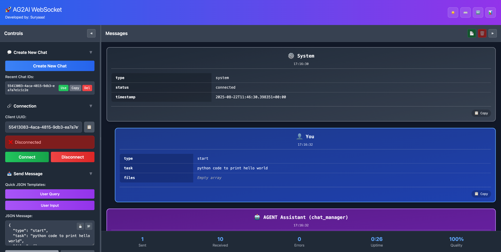

# 🔌 AG2AI WebSocket Agentic Workflow UI & Backend

An interactive WebSocket-based UI and FastAPI backend for orchestrating agentic workflows using [AG2AI Autogen](https://github.com/microsoft/autogen). This project demonstrates real-time, multi-agent collaboration for solving problems through a WebSocket-powered interface — ideal for tasks like data analysis, EDA, and more.



---

## 📦 Overview

This repository includes:

- A clean **frontend UI** to interact with WebSockets visually — more intuitive than Postman or raw clients.
- A **FastAPI backend** that manages real-time WebSocket communication and coordinates multiple agents via AG2AI Autogen.
- A custom **orchestrator agent** (`agent_aligner`) that manages execution flow, ensuring orderly agent coordination.

---


## ✨ Features

### ✅ Frontend

- Interactive WebSocket client with formatted JSON display
- Message blocks styled for clarity and separation
- UUID-based client tracking
- Send/receive messages with live updates
- Manual message construction and quick templates

### ✅ Backend

- Built with **FastAPI** and **async WebSocket** handling
- Modular architecture using manager classes
- Custom `AgentChat` class for group chat orchestration
- Real-time message streaming to frontend
- Manual user input integration during live chat
- Environment-based configuration via `.env`

---

## 🤖 Agents Overview

This system supports the following agents for structured task completion:

- **`planner_agent`**: Produces a step-by-step execution plan (no code).
- **`code_writer`**: Converts the plan into working `python` code.
- **`code_executor`**: Executes code in the local runtime environment.
- **`debugger`**: Detects and resolves runtime errors; retries code.
- **`process_completion`**: Summarizes results and guides the next steps.
- `agent_aligner`: Coordinates the overall workflow, ensuring agents operate in the correct sequence. Enforces the execution flow (Plan → Confirm → Write → Confirm → Execute) to maintain structure, avoid loops, and ensure safe progression.


---

## 📁 Project Structure

```

.
├── managers/
│   ├── cancellation_token.py     # Manages cancellation signals
│   ├── connection.py             # Handles socket connections
│   ├── groupchat.py              # AgentChat orchestration logic
│   ├── prompts.py                # Prompt templates and roles
│
├── templates/
│   └── index.html                # Frontend UI (WebSocket client)
│
├── .env                          # API keys and environment variables
├── dependencies.py               # AG2AI agent setup and configuration
├── helpers.py                    # Utility functions
├── main.py                       # FastAPI server entry point
├── ws.py                         # WebSocket route handler
├── requirements.txt              # Python dependencies
└── Readme.md                     # You're reading it!

````

---

## 🚀 Getting Started

### 1. Clone the Repository

```bash
git clone https://github.com/Suryaaa-Rathore/websocket-ag2ai.git
cd websocket-ag2ai
````

### 2. Create and Activate Virtual Environment

```bash
python -m venv venv
source venv/bin/activate  # On Windows: venv\Scripts\activate
```

### 3. Install Dependencies

```bash
pip install -r requirements.txt
```

### 4. Set Your OpenAI API Key

Create a `.env` file in the root directory:

```
OPENAI_API_KEY=your-openai-api-key
```

Or export the variable directly:

```bash
export OPENAI_API_KEY=your-openai-api-key
```

### 5. Run the Server

```bash
python main.py
```

### 6. Access the Frontend

Open your browser and go to:

```
http://localhost:8000
```

---

## 🔍 Discoverability Tags

* FastAPI WebSocket Manager
* AG2AI Autogen Orchestrator
* Real-time agent workflows
* WebSocket frontend UI
* AI agent orchestration
* Agentic problem solving with Python
* Multi-agent system with streaming responses
* Custom group chat with Autogen

---